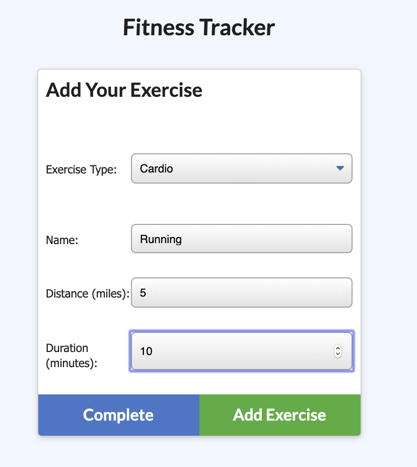

## Workout Tracker App

This is an App will let you enter your workouts for any given day and it will keep track of you the difference exercises you do.

## User Story

As a user, You will be able to view create and track daily workouts. You can log multiple exercises in a workout on a given day. Keep track of the name, type, weight, sets, reps, and duration of exercise. If the exercise is a cardio exercise, you will be able to track my distance traveled.

## Business Context

A consumer will reach their fitness goals quicker when they track their workout progress.

## Link
https://britt-hub.github.io/Workout-Tracker/

## Credits

W3schools.com